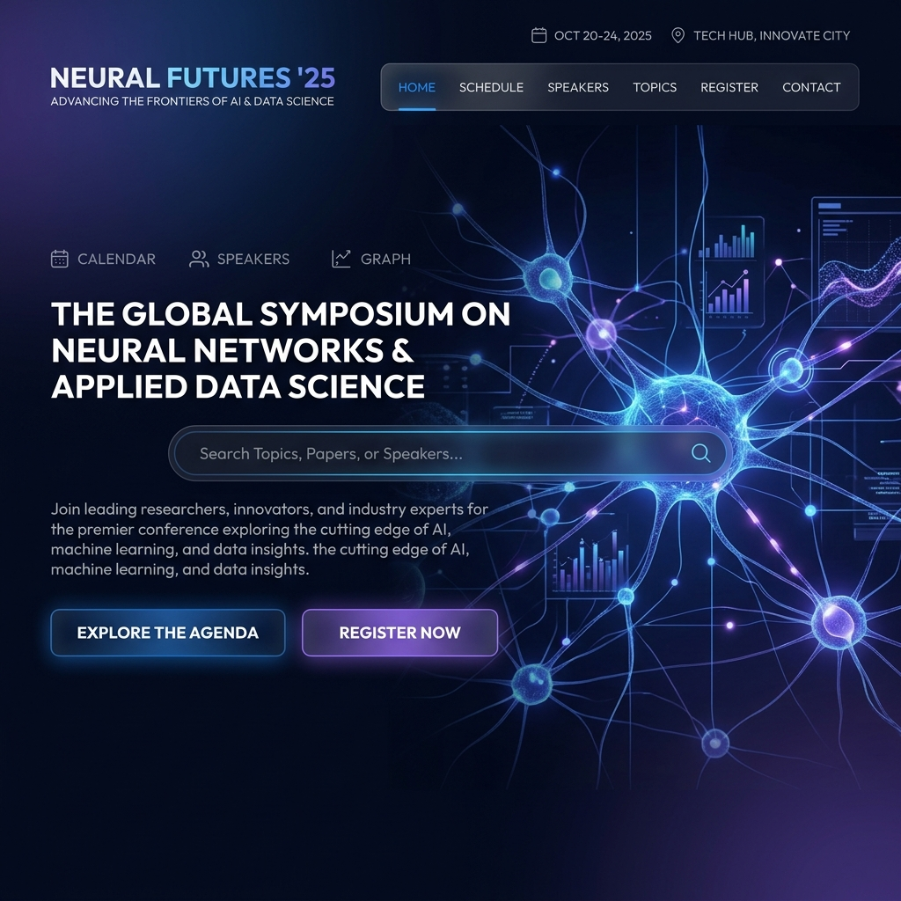
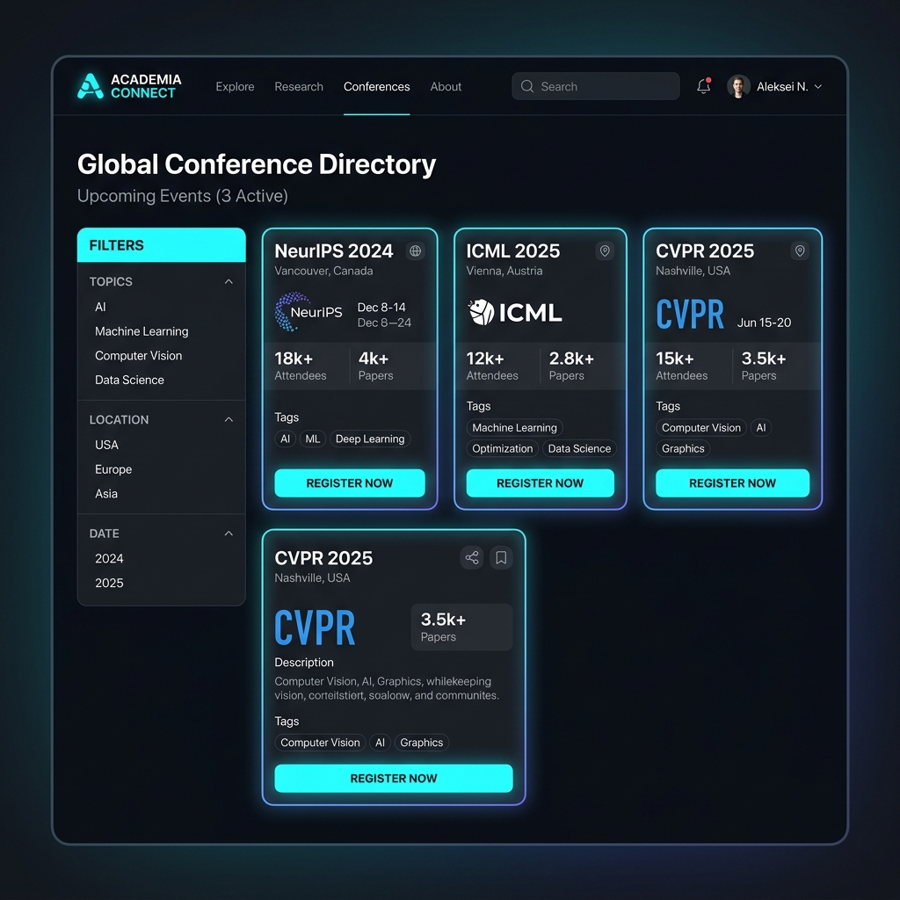
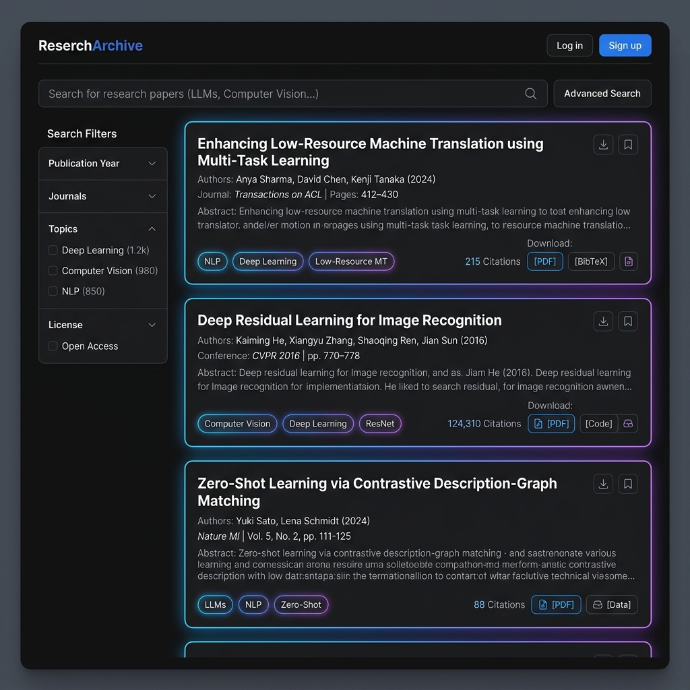
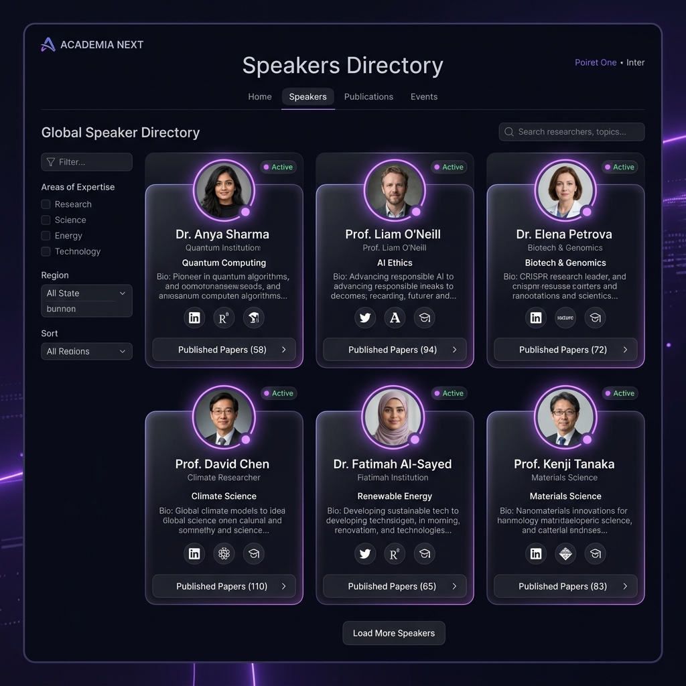
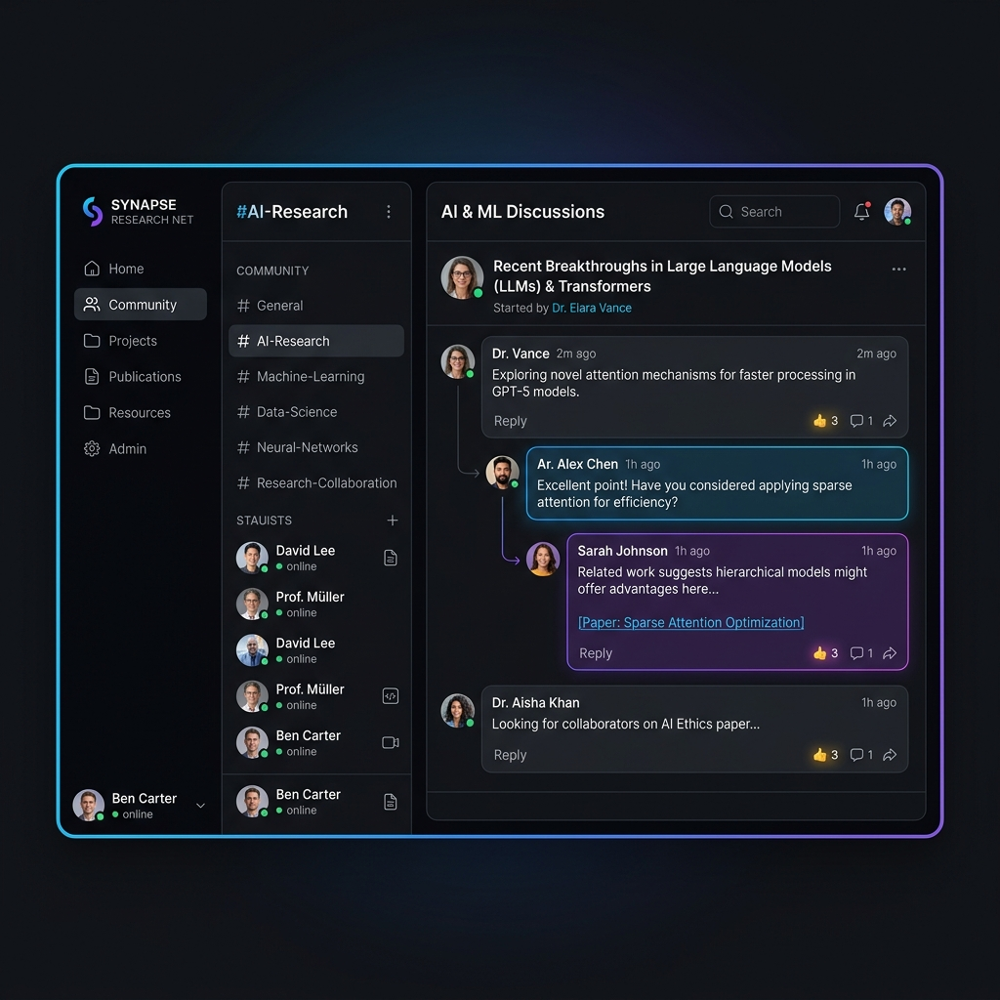
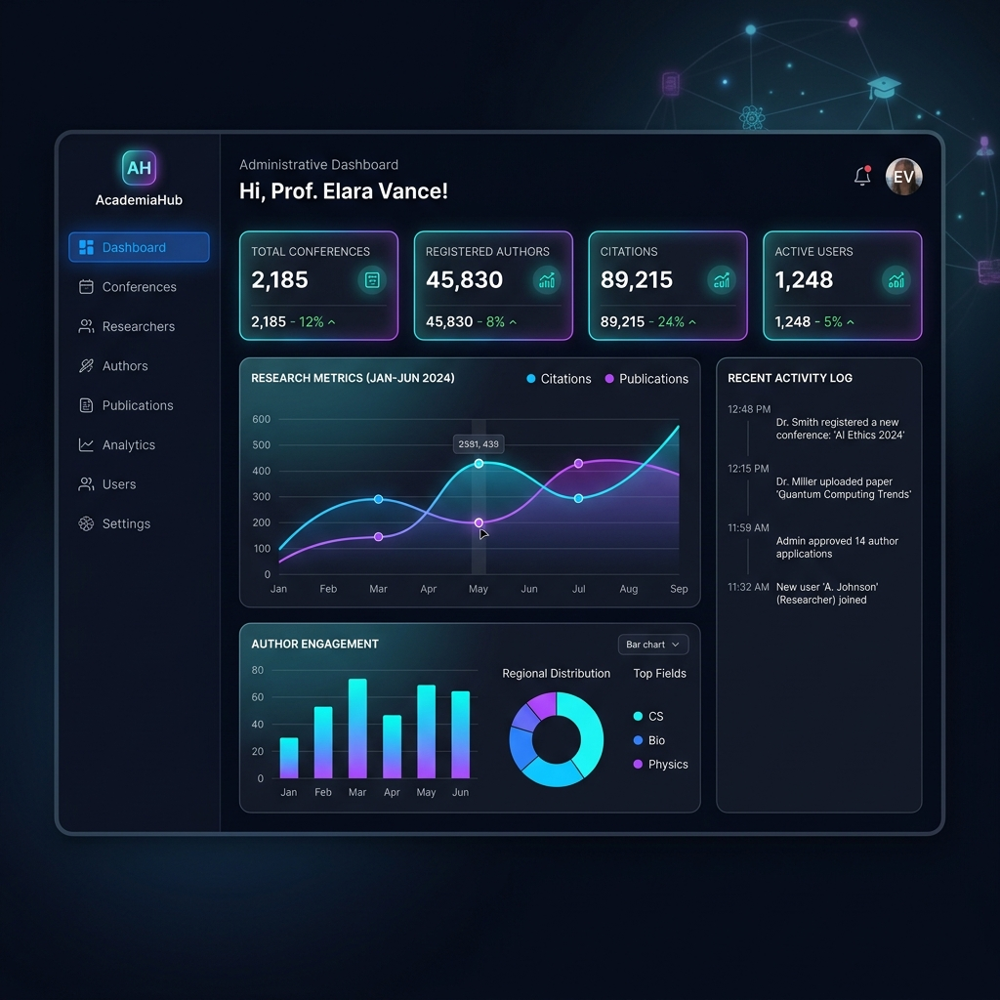
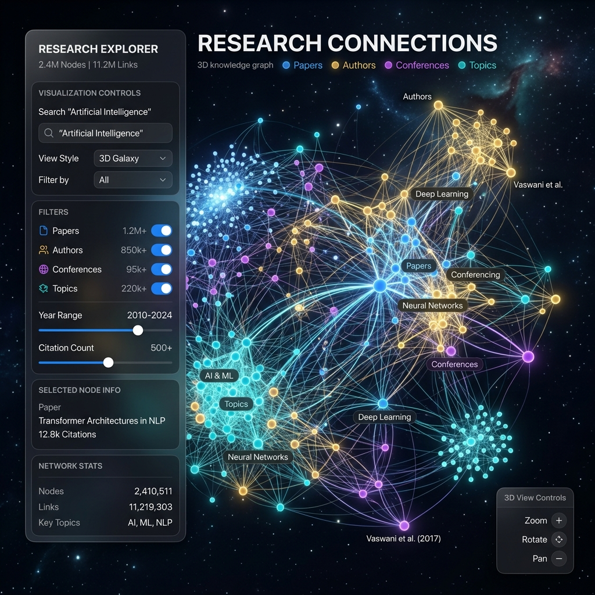
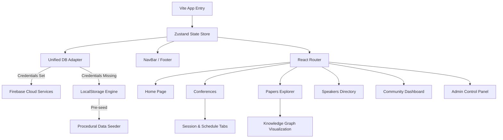

<p align="center">
  
</p>

<h1 align="center">Conference Showcase Website</h1>

<p align="center">
  A modern, feature-rich web platform for showcasing academic conferences, research papers, and distinguished speakers — built with React, TypeScript, and Firebase.
</p>

<p align="center">
  
  
  
  
  
</p>

---

## ✨ Features

- **🏠 Immersive Landing Page** — Canvas particle hero, parallax scroll, live statistics, research domain chips, infinite university marquee
- **📅 Conference Explorer** — Browse, filter, and deep-dive into conferences with session schedules, speaker lineups, and sponsor details
- **📄 Research Papers Hub** — Search and explore publications with split-panel layout, citation counts, topic filtering, and download links
- **🎤 Speaker Directory** — Discover speakers by expertise, institution, and talk history with interactive profile cards
- **👥 Community Dashboard** — Manage bookmarks, registrations, notifications, and researcher profiles
- **🔧 Admin Control Panel** — Full CRUD interface for managing conferences, papers, speakers, and user accounts
- **🌐 Knowledge Graph** — Interactive force-directed citation network visualizing connections between papers, authors, and conferences
- **🎨 Theme System** — Polished dark and light modes with glassmorphism, smooth transitions, and CSS custom properties
- **🔐 Firebase Integration** — Firestore, Authentication, and Storage with transparent LocalStorage fallback
- **⚡ Branded Loader** — Academic knowledge-graph canvas animation with logo, progress bar, and status updates

---

## 🖼️ Screenshots

<table>
  <tr>
    <td align="center"><b>Home — Hero Section</b></td>
    <td align="center"><b>Conferences</b></td>
  </tr>
  <tr>
    <td></td>
    <td></td>
  </tr>
  <tr>
    <td align="center"><b>Research Papers</b></td>
    <td align="center"><b>Speakers</b></td>
  </tr>
  <tr>
    <td></td>
    <td></td>
  </tr>
  <tr>
    <td align="center"><b>Community Dashboard</b></td>
    <td align="center"><b>Admin Panel</b></td>
  </tr>
  <tr>
    <td></td>
    <td></td>
  </tr>
  <tr>
    <td align="center"><b>Knowledge Graph</b></td>
    <td align="center"><b>Branded Loader</b></td>
  </tr>
  <tr>
    <td></td>
    <td></td>
  </tr>
</table>

---

## 🏗️ Architecture



---

## ⚙️ Tech Stack

| Layer | Technology |
| :--- | :--- |
| **Frontend** | React 19, TypeScript 6.0 |
| **Build Tool** | Vite 8.0 |
| **Styling** | TailwindCSS 3.4, CSS Custom Properties |
| **Animations** | Framer Motion 12, Canvas API |
| **State** | Zustand 5.0 |
| **Backend** | Firebase (Firestore, Auth, Storage) |
| **Icons** | Lucide React |
| **Forms** | React Hook Form + Zod |
| **Tables** | TanStack Table |

---

## 📂 Project Structure

```
Conference-Showcase-Website/
├── docs/                       # Documentation
│   ├── dev-journal/            # Weekly development logs
│   └── screenshots/            # Project screenshots
├── public/                     # Static assets
│   ├── logo.png                # Brand logo
│   ├── favicon.svg             # SVG favicon
│   └── icons.svg               # Icon sprite sheet
├── src/
│   ├── assets/                 # Images and SVGs
│   ├── components/
│   │   ├── NavBar.tsx          # Responsive glassmorphic header
│   │   ├── Footer.tsx          # Footer with newsletter form
│   │   ├── NetworkLoader.tsx   # Branded canvas loading screen
│   │   ├── KnowledgeGraph.tsx  # Force-directed citation graph
│   │   ├── PageHero.tsx        # Shared video hero for inner pages
│   │   ├── Logo.tsx            # Logo component with glow effect
│   │   └── SafeLogo.tsx        # Error boundary logo wrapper
│   ├── db/
│   │   ├── seedData.ts         # Procedural data generator (1000+ entities)
│   │   └── dbAdapter.ts        # Firebase / LocalStorage adapter
│   ├── pages/
│   │   ├── Home.tsx            # Landing page with canvas hero
│   │   ├── Conferences.tsx     # Conference directory & detail view
│   │   ├── Papers.tsx          # Research papers explorer
│   │   ├── Speakers.tsx        # Speaker profiles directory
│   │   ├── Community.tsx       # User dashboard & profiles
│   │   └── Admin.tsx           # CRUD admin control panel
│   ├── store/
│   │   └── useStore.ts         # Zustand global state
│   ├── index.css               # Design system & theme tokens
│   ├── App.tsx                 # Router & layout shell
│   ├── App.css                 # App-level styles
│   └── main.tsx                # React DOM entry
├── index.html                  # Vite entry with SEO tags
├── tailwind.config.js          # Custom Tailwind theme
├── vite.config.ts              # Vite configuration
└── package.json                # Dependencies
```

---

## 🚀 Getting Started

### Prerequisites
- Node.js v18 or higher
- npm or yarn

### Installation

```bash
# Clone the repository
git clone https://github.com/Self-Lakshh/Conference-Showcase-Website.git
cd Conference-Showcase-Website

# Install dependencies
npm install
```

### Development

```bash
npm run dev
```

Open [http://localhost:5173](http://localhost:5173) — the branded loader will run, seed the database, and launch the platform.

### Production Build

```bash
npm run build
npm run preview
```

---

## 🔥 Firebase Setup (Optional)

The app works out of the box with LocalStorage and seeded data. To connect to Firebase:

1. Create a Firebase project in the [Google Console](https://console.firebase.google.com)
2. Enable **Firestore Database**, **Authentication (Email/Password)**, and **Storage**
3. Create a `.env` file in the project root:

```env
VITE_FIREBASE_API_KEY=your_api_key
VITE_FIREBASE_AUTH_DOMAIN=your_auth_domain
VITE_FIREBASE_PROJECT_ID=your_project_id
VITE_FIREBASE_STORAGE_BUCKET=your_storage_bucket
VITE_FIREBASE_MESSAGING_SENDER_ID=your_sender_id
VITE_FIREBASE_APP_ID=your_app_id
```

4. Restart the dev server — the adapter will connect to Firestore automatically.

---

## 🗄️ Database Schema

| Collection | Key Fields | Relationships |
| :--- | :--- | :--- |
| `users` | id, email, name, role, avatar | Owns registrations & bookmarks |
| `conferences` | id, title, venue, dates, tracks, sessions | Links speakers, papers, sponsors |
| `papers` | id, title, abstract, topics, citations | References authors & conferences |
| `speakers` | id, name, title, bio, interests, timeline | Linked to institutions |
| `institutions` | id, name, logo, location, type | Referenced by speakers & papers |
| `registrations` | id, userId, conferenceId, ticketCode | Bridges users & conferences |
| `bookmarks` | id, userId, type, itemId | Saved papers, events, speakers |
| `notifications` | id, userId, title, message, date | Generated on user actions |

---

## 📄 License

This project is open source and available under the [MIT License](LICENSE).

---

<p align="center">
  Built with ❤️ by <a href="https://github.com/Self-Lakshh">Lakshya Chopra</a>
</p>
